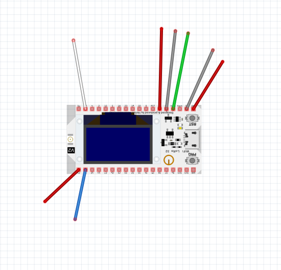

# 1D-pong

This is an ESP32 (at least that) version of the all well known warareg 1-D Pong game
also known as `one_d_pong`. 
This version is a fork from [Computer Truhe](https://git.chch.it/rob/1D-pong).

This is a linear pong game where the bat is a home area of about 7 pixels. Depending on
how deep you let the ball run into your home area, the faster it is repelled. If you 
fail to press the button in time you loose a point since the ball enters your home.
This version supports a boost button which sacrefies one pixel of your home area in 
favor of boosting your ball faster.

# Notes
Some pins do not allow to configure Pull up resistors or work only as output. Don't use them.

 
